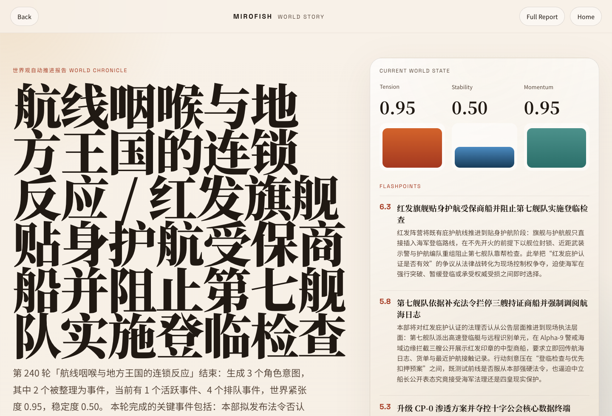
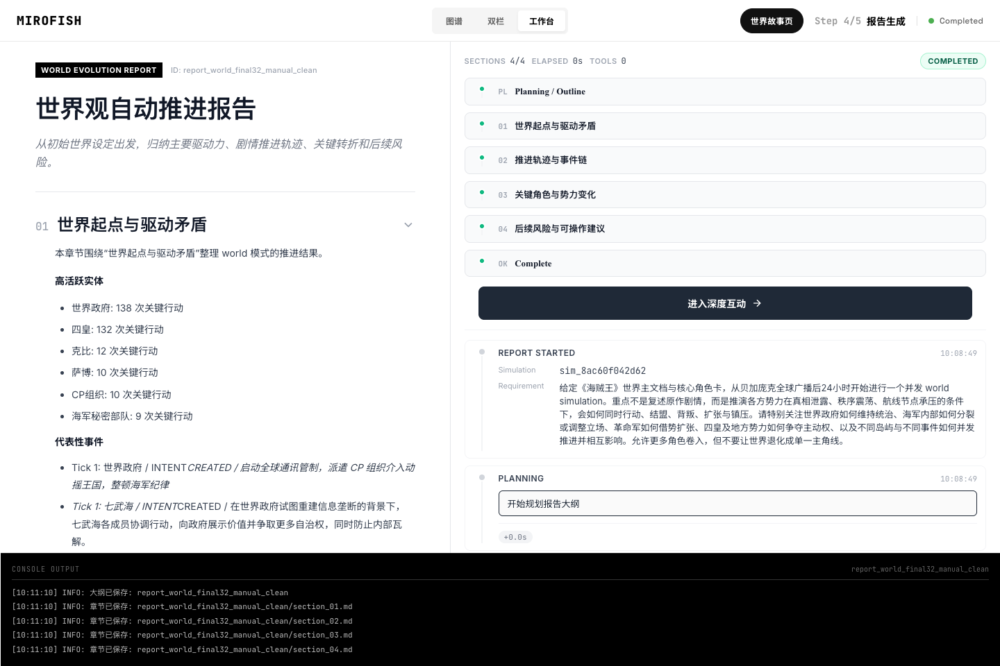

<div align="center">


# MiroFish World Fork

A MiroFish fork focused on long-running world simulation: multi-model routing, checkpoint / resume, world presets and evals, operator tooling, and a workflow for persistent world progression.

[English](./README-EN.md) | [中文文档](./README.md)

</div>

## Fork Positioning

- Upstream project: [`666ghj/MiroFish`](https://github.com/666ghj/MiroFish)
- This repository keeps the GitHub fork relationship and extends the upstream with a much stronger `world mode` runtime
- License remains `AGPL-3.0`

If you want the original positioning of MiroFish as a broad multi-agent prediction engine, read upstream.  
If you want "given lore, actors, conflicts, and rules, keep the world advancing over time with checkpoint / resume / eval / diagnostics", this fork is the more accurate entry point.

## What This Fork Actually Focuses On

- Treating `world mode` as a first-class runtime
- Hardening the full `checkpoint -> resume -> restore -> finalize` chain
- Operator CLI for world runs:
  - `compile-pack`
  - `run`
  - `resume`
  - `status`
  - `restore`
  - `finalize`
  - `staged`
  - `pipeline`
- Better runtime observability:
  - `run_state.json`
  - `world/checkpoint.json`
  - `world/actions.jsonl`
  - `world/state_snapshots.jsonl`
  - `world/diagnostics/*.md|json`
  - `world chronicle / actor board / risk digest`
- Multi-provider / multi-model routing:
  - `llm_registry.json`
  - OpenClaw config reuse
  - per-agent `llm_selector` in world mode
- Presets and evals for repeatable strategy selection:
  - `backend/evals/world_runtime_presets.json`
  - `backend/evals/world_model_eval_*.json`
  - `backend/evals/world_case_sets/*.json`

## Good Fits

- worldbuilding progression
- long-form story sandboxes
- multi-faction or multi-character conflict simulation
- political / geopolitical / rumor-propagation style worlds
- long-running simulations that need resume, diagnostics, and reviewability

## Showcase

Detailed cases: [docs/showcases/world-mode-runs.en.md](./docs/showcases/world-mode-runs.en.md)

### What You Can Show Immediately

| World Story Surface | World Report Entry |
|---|---|
|  |  |

- the new `world story` surface turns long-running simulation output into `hero -> episodes -> factions -> risks -> process`
- the `report` page now links directly into the story surface instead of forcing manual URL construction
- for the real showcase run, you can open `/world-story/sim_8ac60f042d62`

Two representative runs are already documented:

| Case | Date | Scale | Result |
|------|------|------|--------|
| `sim_8ac60f042d62` | 2026-03-21 | 240 ticks | Long-running world simulation completed with `3594` action rows, `142` accepted intents, and `0` resolver salvages |
| `sim_world_supervised_smoke_20260321_172346` | 2026-03-21 | 2 ticks | Operator-path smoke completed with consistent `run_state / checkpoint / status` outputs |

Why both matter:

- `sim_8ac60f042d62` proves the world can be advanced for a long horizon, not just demo bursts
- `sim_world_supervised_smoke_20260321_172346` proves the operator path is observable while running and auditable after completion

## Recommended Runtime Strategies

After the current eval round, the practical default strategies are:

| Preset | Actor | Resolver | Best For |
|--------|-------|----------|----------|
| `recommended_throughput` | `eval_aliyun_qwen35_flash` | `eval_aliyun_qwen35_plus` | default throughput-oriented world progression |
| `recommended_stable` | `eval_aliyun_qwen35_flash` | `eval_litellm_gpt54_deep` | more stable and easier-to-review critical runs |
| `smoke_benchmark_minimax` | `eval_aliyun_qwen35_flash` | MiniMax smoke resolver | smoke and triage only, not the long-run default |

See:

- [backend/evals/world_runtime_presets.json](./backend/evals/world_runtime_presets.json)
- [backend/evals/README.md](./backend/evals/README.md)
- [backend/evals/world_model_eval_playbook.md](./backend/evals/world_model_eval_playbook.md)

## Quick Start

### 1. Requirements

| Tool | Version |
|------|---------|
| Node.js | `18+` |
| Python | `>=3.11` |
| uv | latest |

### 2. Configure Environment

```bash
cp .env.example .env
cp llm_registry.json.example llm_registry.json
```

The recommended setup is OpenClaw + `llm_registry.json` as the model/provider source of truth.

Minimum suggested `.env`:

```env
LLM_REGISTRY_SOURCE=auto
LLM_REGISTRY_PATH=/absolute/path/to/MiroFish/llm_registry.json
OPENCLAW_CONFIG_PATH=/Users/<you>/.openclaw/openclaw.json

# Still required in the current backend runtime
ZEP_API_KEY=your_zep_api_key

# Legacy fallback only when registry / OpenClaw resolution misses
LLM_API_KEY=
LLM_BASE_URL=
LLM_MODEL_NAME=
```

Notes:

- `ZEP_API_KEY` is still part of the current runtime path
- `llm_registry.json` supports multiple providers, profiles, and routes
- world actors can pick a model with `llm_selector`
- you can reuse OpenClaw model definitions instead of hardcoding all model choices in `.env`

### 3. Install Dependencies

```bash
npm run setup:all
```

If you only care about backend / world CLI:

```bash
npm run setup:backend
```

### 4. Start the App

```bash
npm run dev
```

Default endpoints:

- Frontend: `http://localhost:3000`
- Backend: `http://localhost:5001`

### 5. Prepare a World Simulation

Typical flow:

1. Upload lore, character sheets, story notes, and world rules
2. Choose `World Mode`
3. Let the system produce a `simulation_config.json`
4. Run from UI or switch to the CLI/operator workflow for longer supervised runs

### 6. Compile a World Pack First

If you want reproducible, versionable inputs that bootstrap directly into a resumable simulation, compile the raw materials into a world pack first:

```bash
cd backend

./.venv/bin/python scripts/world_run.py compile-pack \
  --source-dir /absolute/path/to/world-materials \
  --simulation-id sim_my_world \
  --pack-title "My World" \
  --no-llm-profiles
```

This writes a runnable bundle directly into `backend/uploads/simulations/<simulation_id>/`, including:

- `simulation_config.json`
- `world_profiles.json`
- `world_pack/manifest.json`
- `world_pack/source_digest.md`

Details: [docs/operator/world-operator-guide.en.md](./docs/operator/world-operator-guide.en.md)

## World CLI / Operator Workflow

If you want the canonical long-run operator sequence, start here: [docs/operator/world-operator-guide.en.md](./docs/operator/world-operator-guide.en.md)

If you already have a prepared `simulation_config.json`, you can run it directly:

```bash
cd backend

./.venv/bin/python scripts/world_run.py run \
  --config /absolute/path/to/simulation_config.json \
  --max-rounds 8
```

Resume:

```bash
./.venv/bin/python scripts/world_run.py resume \
  --config /absolute/path/to/simulation_config.json \
  --max-rounds 16
```

Fork a parallel timeline from any historical tick that already has a snapshot:

```bash
./.venv/bin/python scripts/world_run.py fork \
  --simulation-id sim_8ac60f042d62 \
  --tick 280 \
  --new-simulation-id sim_8ac60f042d62_fork280
```

This keeps the original simulation untouched and creates a new simulation directory with:

- truncated `world/actions.jsonl`
- truncated `world/state_snapshots.jsonl`
- rebuilt `world/checkpoint.json`
- copied `stimuli.json` so the branch can keep diverging on its own

Status:

```bash
./.venv/bin/python scripts/world_run.py status \
  --config /absolute/path/to/simulation_config.json
```

Diagnostics:

```bash
./.venv/bin/python scripts/world_run_diagnostics.py \
  --simulation-id <simulation_id> \
  --label run16
```

Finalize report:

```bash
./.venv/bin/python scripts/world_run.py finalize \
  --simulation-id <simulation_id> \
  --label final16
```

Run in staged form, for example `8 -> 16`:

```bash
./.venv/bin/python scripts/world_run.py staged \
  --simulation-id <simulation_id> \
  --stage1-rounds 8 \
  --final-rounds 16
```

For a more general multi-stage pipeline:

```bash
./.venv/bin/python scripts/world_run.py pipeline \
  --simulation-id <simulation_id> \
  --stage-rounds 8,16,32,64
```

A practical checklist:

1. `compile-pack` the raw materials into a runnable simulation
2. `run --max-rounds 2` for a smoke pass
3. `pipeline --stage-rounds 8,16,32,...` for supervised long runs
4. read diagnostics plus chronicle / actor board / risk digest
5. `finalize` for the end report

### One Important Observability Detail

In this fork:

- `run_state.json` is the live state consumed by the service / UI side
- `checkpoint.json` is the authoritative last committed tick

That means `run_state` can legitimately be ahead of `checkpoint` while a tick is still executing.  
This is intentional:

- `checkpoint` stays clean at commit boundaries
- `run_state` stays useful for live operator visibility

Once the run reaches a terminal state, they are reconciled automatically.

This fork also writes three higher-level reading surfaces into `world/diagnostics/`:

- `chronicle`: the tick-by-tick world trajectory, mainly from `state_snapshots.jsonl` and `tick_end`
- `actor board`: checkpoint actor selection / event counts joined back to `simulation_config.json`
- `risk digest`: unresolved events from `simulation_end.unresolved_events`, or `active_events + queued_events` as fallback

You can regenerate them directly:

```bash
./.venv/bin/python scripts/generate_world_reading_surface.py \
  --simulation-id <simulation_id> \
  --label final32
```

## Model Routing and Configuration

This fork is not designed around a single global `LLM_API_KEY / LLM_MODEL_NAME` pair for all agents.

The intended setup is:

1. `llm_registry.json` for providers, profiles, and routes
2. OpenClaw as the shared model/config source of truth
3. world presets and selectors for role-specific model assignment

Start here:

- [llm_registry.json.example](./llm_registry.json.example)
- [backend/evals/world_runtime_presets.json](./backend/evals/world_runtime_presets.json)
- [backend/app/services/world_preset_registry.py](./backend/app/services/world_preset_registry.py)

## Eval System

This fork tries to make world strategy selection reproducible, not gut-feel based.

Key references:

- [backend/evals/README.md](./backend/evals/README.md)
- [backend/evals/world_model_eval_playbook.md](./backend/evals/world_model_eval_playbook.md)
- [backend/evals/world_case_sets/README.md](./backend/evals/world_case_sets/README.md)

Key scripts:

- [backend/scripts/eval_world_models.py](./backend/scripts/eval_world_models.py)
- [backend/scripts/run_world_model_eval_campaign.py](./backend/scripts/run_world_model_eval_campaign.py)
- [backend/scripts/run_world_model_eval_stage.py](./backend/scripts/run_world_model_eval_stage.py)
- [backend/scripts/eval_world_strategy.py](./backend/scripts/eval_world_strategy.py)

## Repository Layout

```text
MiroFish/
├── backend/
│   ├── app/
│   ├── evals/
│   ├── scripts/
│   └── uploads/
├── frontend/
├── docs/
│   ├── operator/
│   └── showcases/
├── llm_registry.json.example
├── README.md
└── README-EN.md
```

The directories you will touch most often:

- `backend/scripts/`: world run / diagnostics / report / eval scripts
- `backend/evals/`: presets, eval suites, playbooks, case sets
- `backend/uploads/simulations/`: runtime artifacts
- `docs/operator/`: operator workflow, world pack, and long-run pipeline guides
- `docs/showcases/`: shareable showcase pages that belong in Git

## Current Boundaries

- deep world interaction is still centered on `ReportAgent`, not live character interviews
- tick-level checkpoints are only written at commit points, so mid-tick visibility mainly lives in `run_state.json`
- world runtime quality still depends materially on provider health and model structured-output behavior
- this fork now has much better diagnostics, evals, and playbooks, but it is still not a zero-ops system

## Upstream and Credits

- Upstream: [`666ghj/MiroFish`](https://github.com/666ghj/MiroFish)
- Simulation engine roots: [`camel-ai/oasis`](https://github.com/camel-ai/oasis)

The goal of this fork is not to erase upstream.  
It is to keep the relationship visible, preserve the license, and keep pushing the world-simulation line forward.

## License

This repository continues to use the upstream license: `AGPL-3.0`
